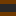
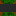

# go-wfc-demo

Golang Wave Function Collapse Demo


This demo is generating a map based on a set of "structs" located in the input.json file. The main idea behind of this
demo was to create a 2D map based on those tiles as fast as possible.

*Structs textures:*








The only reason that's possible is because of each struct reference a connection_id for each of its faces, similar to
sudoku, each tile can only connect with a selected list of structs on each of its faces.

*Structs example:*

```yaml
0: dirt
1: grass
2: grass_road
3: dirt_road
4: forest
```

```json
[
  {
    "texture": "flowers.png",
    "allow_rotation": true,
    "pos_x": 1,
    "pos_y": 1,
    "neg_x": 1,
    "neg_y": 1,
    "pos_z": -1,
    "neg_z": -1
  },
  ...
  {
    "texture": "dirt.png",
    "allow_rotation": true,
    "pos_x": 0,
    "pos_y": 0,
    "neg_x": 0,
    "neg_y": 0,
    "pos_z": -1,
    "neg_z": -1
  },
  ...
  {
    "texture": "grass.png",
    "allow_rotation": true,
    "pos_x": 1,
    "pos_y": 1,
    "neg_x": 1,
    "neg_y": 1,
    "pos_z": -1,
    "neg_z": -1
  },
  {
    "texture": "grass_road_straight.png",
    "allow_rotation": true,
    "pos_x": 1,
    "pos_y": 2,
    "neg_x": 1,
    "neg_y": 2,
    "pos_z": -1,
    "neg_z": -1
  },
  ...
]
```

The algorithm is also able to calculate rotations of each tile/structs. In addition, theoretically, the algorithm could
also create a 3D map, though, never tested it before.

## HOW TO?

Just build, run the executable, and open the `index.html` file in your browser :) Though, opening it directly in your
browser might not work cause of modern browser's cors settings, for that reason I recommend to open it with a tool
as `live-serve` or `http-serve` or any other http server application that you are familiar with.

### Compile and Run

First of all, you'll need to be sure that you rocking golang version 1.19 in your machine, just run `go version` in your
terminal. If the version you have available locally is older than 1.19, you can always download the current version from
go.dev https://go.dev/dl/. It is possible that you'll be able to compile the project with an older version than 1.19,
but it's not well tested, you might experience issues.

The next step is actually pretty simple, just build and run the executable :)

```shell
go build & wfc.exe
```

## Dependencies and Libraries

This project is using no libraries or dependencies other than what golang version 1.19 is already including.
